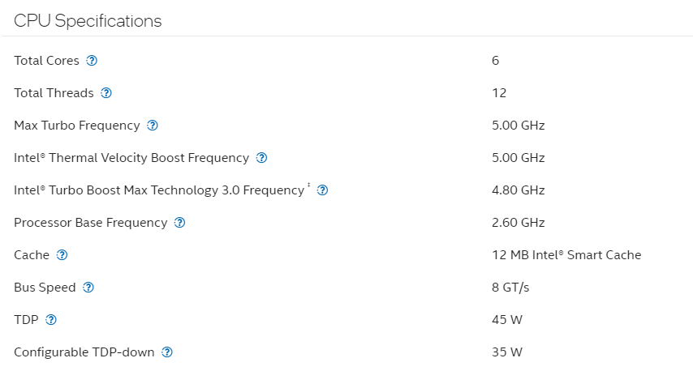

# **Parallel Programming**
## *Authors*
    Pablo Bolio Pradilla - A01782428

    Shaul Zayat Askenazi - A01783240

### Introduction

This code executes a function responsible for finding prime numbers within a range defined by the user and then outputs the sum of all the numbers found.

### Definition
A prime number is a natural number greater than 1 that has no positive divisors other than 1 and itself. In other words, a prime number cannot be evenly divided by any other number except for 1 and itself.

### Features

A feature of this program is that the user can choose the number of threads for execution, in other words, the task can be distributed evenly to make the execution faster and more efficient (the user can choose the number of threads to use). The exercise requires finding and summing all the prime numbers between 1 and 5,000,000, resulting in *838,596,693,108*.

To measure the efficiency between single-thread and multi-thread tests, the execution time is calculated for each case using the following formula:

$S_p = \frac{T_1}{T_p}$

Where:

**$p$** is the number of threads

**$T_1$** is the execution time with a single thread

**$T_p$** is the execution time with $p$ threads

**$S_p$** is the speedup obtained using $p$ threads

### CPU Specifications

This program was executed on an Intel *i7-1750H* with the following specifications:

### Execution
 To run this project, you must use this specific command on your CLI:
- `iex prime.exs`

After that, the Interactive Elixir Shell is entered, once there you have to input this command:
- `Hw.prime_sum(<start>, <finish>, <threads>)`

If you want to obtain the time it took for the CPU to process the task, execute the following command:

- `:timer.tc(fn -> Hw.prime_sum(<start>, <finish>, <threads>) end)`

### Runs 

|Run#          | Threads     | Time(s)/Average|Speedup|    
| -----------  | ----------- | ----------- | ----------- |
|   10         | 1           |  28.3419    |    1.00     |
|   10         | 2           |  19.3933    |    1.46     |
|   10         | 4           |  11.2259    |    2.52     |
|   10         | 8           |  7.7051     |    3.68     |
|   10         | 10          |  6.8736     |    4.12     |
|   10         | 12          |  6.4892     |    4.37     |

 

### Extra Runs > 12 threads
|Run#          | Threads     | Time(s)/Average|Speedup|    
| -----------  | ----------- | ----------- | ----------- |
|   10         | 24          |   5.9920    |    4.72     |
|   10         | 48          |   6.0411    |    4.69     |

As can be observed, once the number of threads available on our CPU is exceeded, the efficiency of the process does not increase and, as seen in the last case, it even decreases.